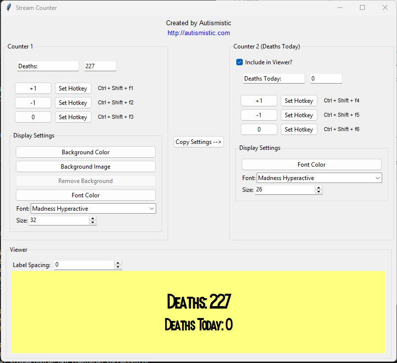

# StreamCounter

 <!-- Replace with an actual screenshot -->

**StreamCounter** is a dual-counter application designed for streamers and gamers to track in-game metrics like deaths, scores, or other stats in real-time. Built with Python and Tkinter, it offers a user-friendly interface with customizable features, including hotkey support, font and background customization, adjustable viewer spacing, and a combined viewer for easy integration with streaming software like OBS Studio. Created by [Autismistic](http://autismistic.com).

## Features
- **Dual Counters:** Track two separate metrics (e.g., total deaths and daily deaths).
- **Combined Viewer:** Display both counters in a single viewer for easy streaming capture.
- **Customizable Hotkeys:** Set hotkeys for incrementing, decrementing, and resetting each counter.
- **Font Customization:** Adjust font family, size, and color for each counter.
- **Background Customization:** Set a background color or image for the viewer (controlled by Counter 1).
- **Copy Settings:** Easily copy font settings from Counter 1 to Counter 2.
- **Adjustable Viewer Spacing:** Customize the vertical spacing between the two counter labels in the viewer.
- **Persistent Settings:** Automatically saves your settings between sessions.

## Installation

### Precompiled Executable
1. Download the latest `StreamCounter.exe` from the [Releases](https://github.com/yourusername/StreamCounter/releases) page.
2. Run `StreamCounter.exe` on your Windows machine.
   - Note: You may need to allow the app through Windows Defender or your antivirus software, as it’s an unsigned executable.

### From Source
If you prefer to run the program from source or compile it yourself, follow these steps:

#### Prerequisites
- Python 3.6 or higher
- Required Python packages:
  - `tkinter` (usually included with Python)
  - `Pillow` (for image support)
  - `pynput` (for hotkey support)

Install the required packages using pip:
```bash
pip install Pillow pynput
